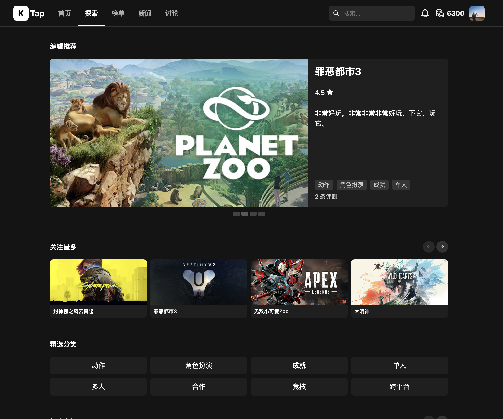
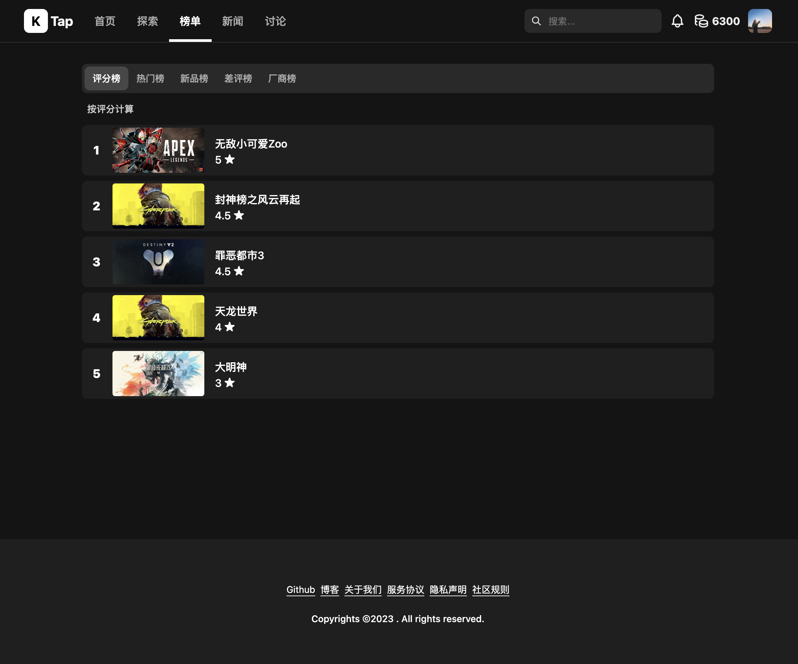
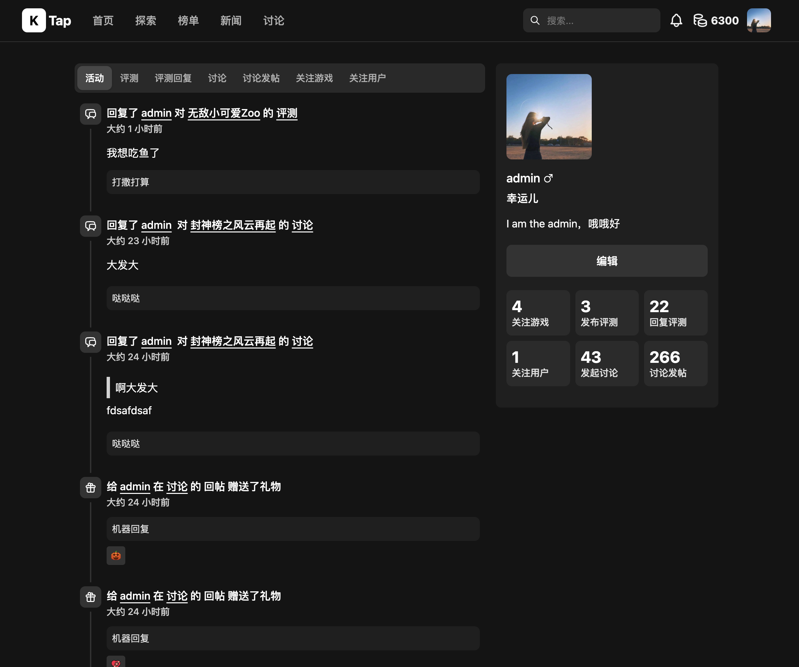

# KTap

KTap是一个时尚的游戏社区平台。

## 功能列表

* 用户：注册、登录、个人中心、动态、成就等。
* 游戏：评测、回复、礼物、赞踩、新闻等
* 讨论：发帖、回帖、改贴、删帖、礼物、赞踩、置顶、锁帖（开锁）、举报等。
* 探索
* 排行榜
* 搜索
* 通知：系统、关注、反馈
* 运营后台管理：用户、游戏、评测、讨论、标签……
* ……

## 截图

<table>
    <tr>
        <td></td>
        <td></td>
        <td></td>
        <td></td>
        <td></td>
    </tr>
    <tr>
        <td></td>
        <td></td>
        <td></td>
        <td></td>
        <td></td>
    </tr>
</table>

注意：截图可能落后于最新的。

这里弄了一个 [DEMO](https://ktap.ruislan.com)，可以快速预览和玩起来。（最低云配置，请轻一点～，同时可能会不定时清理数据）。

## 快速开始

### 环境设置

下载代码之后，首先修改.env.example，将其改为.env，然后按照自己的需要修改.env中的内容，以“MAILER_”开头的为邮件服务，你需要查询你的邮件供应商的配置，然后配置到.env文件中，发送邮件的lib是nodemailer，你也可以查看其文档来做一个深入了解。开发时默认用的是outlook，你也可以临时申请一个新的邮箱，不配置也行，就是找回密码功能不能使用。

### 手动启动

首先启动mysql服务，然后启动服务端ktap-server，进入目录后输入以下指令启动：

```bash
cd ktap-server
pnpm install
pnpm prisma db push
pnpm seed:dev
pnpm dev
```

关于 Seed ：

* 通过命令"pnpm seed:dev" 进行数据初始化。将初始化少量数据，但是涵盖了几乎所有用到的场景，例如用户、游戏、评测、回复、标签、礼物等等等等。可以用于开发和测试功能。
* 通过命令"pnpm seed:steam" 进行数据初始化，将初始化的内容包括基础数据和用户以及gameList中所有的steam游戏(通过steam api下载)，并且在服务启动后，通过/admin-panel，在管理站点，在用户、评测、回复等管理页面下，可以看到一个🚀的按钮，点击即可进行疯狂的数据生成，首先可以生成几十万用户，然后选择几个用户生成几十万个评测，再生成上百万个回复。这样网站看起来就生机勃勃，可以用于各种玩耍。

注意：seed:steam 会清空数据库并重新初始化。

ktap-ui-web为前端代码，进入目录后输入以下指令启动：

```bash
cd ktap-ui-web
pnpm install
pnpm dev
```

完成后访问 [http://localhost:5173](http://localhost:5173)即可开始探索之旅。登录用户和密码可以在seed.js文件中查看。

### Docker启动

可直接采用docker-compose快速启动。

```bash
docker-compose up -d
```

### 跨域问题

默认是在同origin下，在开发环境下，采用了proxy方式。如果要分开部署（例如：api.example.com和example.com）请自行修改代码（注意cookie跨域）。

## 环境与工具

* Language: NodeJS v18
* Web Framework: Fastify
* Front Framework: ReactJS
* Styling: BaseWeb UI
* Database: SQLite
* ORM: Prisma
* Other Libs:
  * day-fns: date helper
  * photoswipe: explore and scale images
  * swiper
  * tiptap: amazing editor
  * sanitize-html
  * nodejieba: 中文分词
  * nodemailer: email helper
  * node-cache: simple cache
  * node-cron: simple schedule

SQLite仅仅作为开发、演示和独立小规模运营是非常棒的，甚至性能也非常好。不过，如果要正式运营，推荐使用MySQL或者PostgreSQL（当然，有些代码要做针对性的调整）。

## 接下来

接下来可能会研发的功能...

* 增加 App 活动事件（线上或者线下活动）
* 增加组织管理（组织所有人自己管理自己的组织）
* 增加专题专栏（例如节日专题，打折专题，新品专题等等）
* 增加商城和充值（余额购买虚拟或者实体商品）
* 增加搜索引擎，改进搜索、相关性算法
* 数据库支持MySQL或PG

## 致敬

感谢以下几个网站给我的灵感，向你们致敬。

* [Taptap](https://taptap.cn/)
* [Steam](https://store.steampowered.com/)
* [Epic Games](https://store.epicgames.com/zh-CN/)
* [IGDB](https://igdb.com/)
