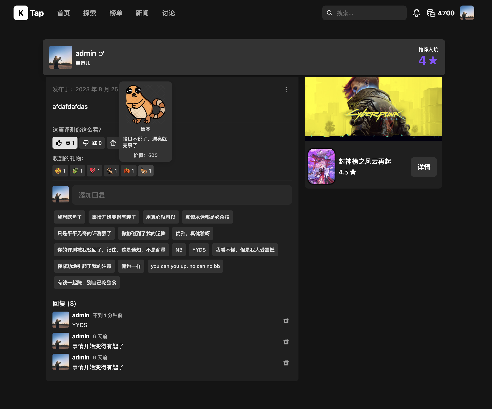

# KTap

## 简介

KTap是一个游戏为中心的社区平台，我做它的目的就是玩一下ReactJS及其相关的UI组件库，所以设计会显得比较随心随性，初期不会考虑太多，例如性能优化、国际化展示等。

## 技术栈

* Language: NodeJS v18
* Web Framework: Fastify
* Front Framework: ReactJS
* Styling: BaseWeb UI
* Database: SQLite
* ORM: Prisma
* Some useful libs:
  * dayjs: 处理日期
  * photoswipe: 图片放大和浏览
  * swiper: 滚动效果
  * tiptap: 非常牛的 Editor。
  * sanitize-html: 清理 Editor 输入的 HTML 标签
  * nodejieba: 中文分词
  * nodemailer: 发送邮件
  * node-cache: 简单缓存
  * node-cron: 简单定时计划

我对技术栈没有特别的倾向性，选择JS Stack主要原因有两个。第一，写起来方便，快捷，自由度高。第二，和前端语言保持一致。第三，社群资源等也很丰富。

SQLite仅仅作为开发和演示是OK的，甚至性能也挺好。但是如果要运营，推荐使用MySQL或者PostgreSQL（当然，有些代码要做针对性的调整）。

## 环境和工具

* OS: macOS Ventura
* IDE: Visual Studio Code
* DBTool: DBeaver

## 功能列表

* 用户：注册、登录、个人中心、动态等。
* 游戏：评测、回复、礼物、赞踩等
* 讨论：发帖、回帖、礼物、赞踩等。
* 探索
* 新闻
* 排行榜
* 搜索
* 后台管理

等等等等功能，自行探索。

## 截图

<table>
    <tr>
        <td></td>
        <td></td>
        <td></td>
        <td></td>
    </tr>
    <tr>
        <td></td>
        <td></td>
        <td></td>
        <td></td>
    </tr>
    <tr>
        <td></td>
        <td></td>
        <td></td>
        <td></td>
    </tr>
    <tr>
        <td></td>
        <td></td>
        <td></td>
        <td></td>
    </tr>
    <tr>
        <td></td>
        <td></td>
        <td></td>
        <td></td>
    </tr>
</table>

注意：截图可能落后于最新的。

## 快速开始

### 环境设置

下载代码之后，首先修改.env.example，将其改为.env，然后按照自己的需要修改.env中的内容，以“MAILER_”开头的为邮件服务，你需要查询你的邮件供应商的配置，然后配置到.env文件中，发送邮件的lib是nodemailer，你也可以查看其文档来做一个深入了解。开发时默认用的是outlook，你也可以临时申请一个新的邮箱，不配置也行，就是找回密码功能不能使用。

### 手动启动

ktap-server为服务端代码，进入目录后输入以下指令启动：

```bash
yarn prisma db push
yarn seed
yarn start:dev
```

ktap-ui-web为前端代码，进入目录后输入以下指令启动：

```bash
yarn start
```

完成后访问 [http://localhost:3000](http://localhost:3000)即可开始探索之旅。登录用户和密码可以在seed.js文件中查看。绝大部分页面都是Responsive的。

### Docker启动

可直接采用docker-compose启动快速启动或者部署

```bash
docker-compose up
```

### 两个数据初始化方式

* 通过命令"yarn seed" 进行数据初始化。将初始化少量数据，但是涵盖了几乎所有用到的场景，例如用户、游戏、评测、回复、标签、礼物等等等等。可以用于开发和测试功能。
* 通过命令"yarn seed:steam" 进行数据初始化，将初始化的内容包括基础数据和用户以及gameList中所有的steam游戏(通过steam api下载)，并且在服务启动后，通过/admin-panel，在管理站点，在用户、评测、回复等管理页面下，可以看到一个🚀的按钮，点击即可进行疯狂的数据生成，首先可以生成几十万用户，然后选择几个用户生成几十万个评测，再生成上百万个回复。这样网站看起来就生机勃勃，可以用于各种玩耍。

注意：两种数据初始化都会清空数据库并重新初始化。

### 跨域问题

默认是在同origin下，在开发环境下，采用了proxy方式。如果要分开部署（例如：api.example.com和example.com）请自行修改代码（注意cookie跨域）。

## Next

* 还有不少功能和想法（例如用户成就体系、游戏讨论、游戏截图与视频等）没有做进去，会持续做进去。
* 增加搜索引擎，改进搜索、相关性
* ~~BaseWeb已经快1年没有更新了~~（居然时隔大半年更新到了v13.0.0），即便如此，我依然比较期待[NextUI](https://nextui.org)，虽然其第一版还没有release，release 之后会酌情替换。
* 数据库新增MySQL或PG（SQLite只有文件锁）
* 持续重构和优化。

## 致敬

感谢以下几个网站给我的灵感，向你们致敬。

* [Taptap](https://taptap.cn/)
* [Steam](https://store.steampowered.com/)
* [Epic Games](https://store.epicgames.com/zh-CN/)
* [IGDB](https://igdb.com/)
