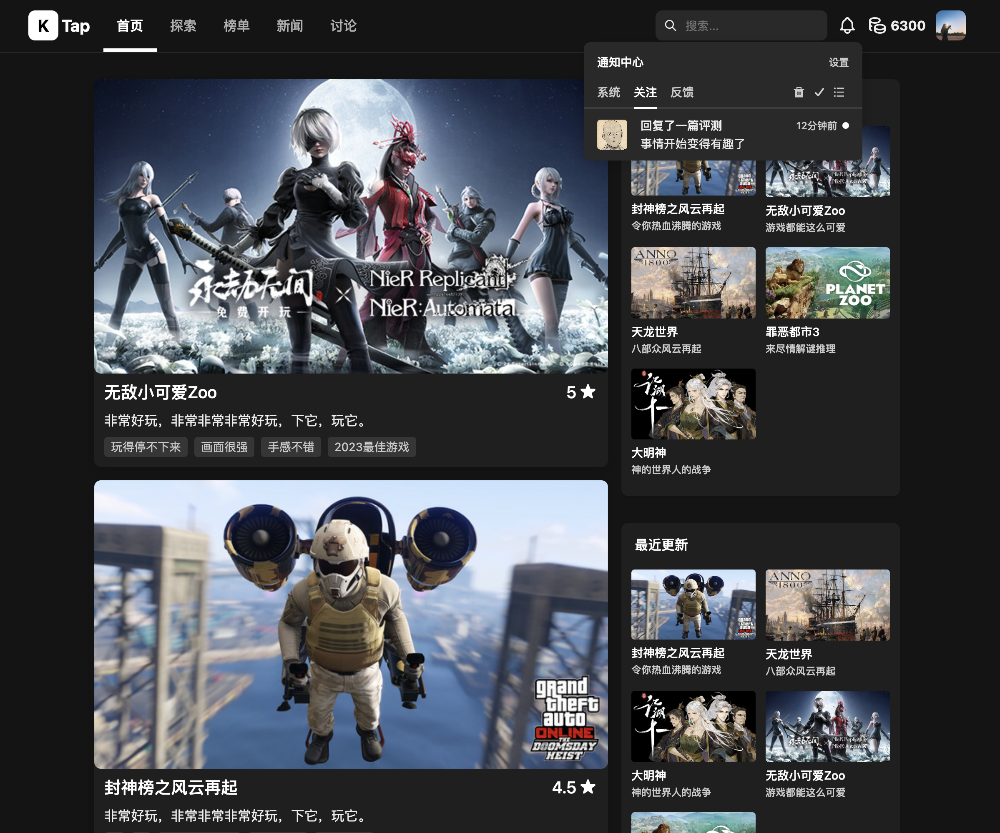
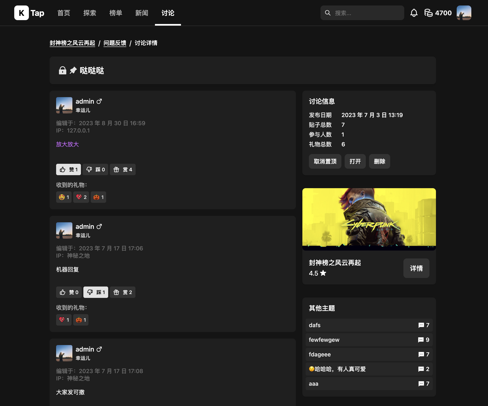

# KTap

KTap is a modern gaming community platform. [中文](./README.zh-CN.md)

## Screenshots

<table>
    <tr>
        <td></td>
        <td></td>
        <td></td>
        <td></td>
        <td></td>
    </tr>
    <tr>
        <td></td>
        <td></td>
        <td></td>
        <td></td>
        <td></td>
    </tr>
</table>

Here is a [DEMO](https://ktap.ruislan.com) for preview. Minimum cloud configuration, please be gentle~, and data may be cleared at any time.

## Features

* Users: Register, Login, User Center, Activity, Achievement, ...
* Gaming: Review, Comment, Gift, Like, News, ...
* Discussion：Post, Reply, Gift, Like, Sticky, Lock, Report, Moderator, ...
* Others: Discover，Notification，Search, Rank, Tags, Admin Dashboard, ...

## Running Locally

### Setup

1. Modify .env.example to .env
2. Config your email in .env, the properties starting with "MAILER_"
3. Config other properties
4. Start Mysql Server

### Running

Start backend

```bash
cd ktap-server
pnpm install
pnpm prisma db push
pnpm seed:dev
pnpm dev
```

Start frontend

```bash
cd ktap-ui-web
pnpm install
pnpm dev
```

visit [http://localhost:5173](http://localhost:5173) and enjoy.

### About Seed

* Initialize data through the command "pnpm seed:dev", A small amount of data will be initialized, but it covers almost all used scenarios, such as users, games, comments, replies, tags, gifts, etc. Can be used to develop and test functionality.
* Initialize the data through the command "pnpm seed:steam". The initialized content includes basic data and users and all steam games in the gameList (downloaded through the steam api). After the service is started, enter the url "/admin-panel", you can see a 🚀 button in some pages. Click it to generate a huge amount of data, like users, reviews, comments and so on. !!!Note, this command will clear database and re-initialize it.

### Docker

```bash
docker-compose up -d
```

## Build with

* Language: NodeJS v20
* Web Framework: Fastify
* Front Framework: ReactJS
* Styling: BaseWeb UI
* Database: SQLite(v1.2.0) MySQL(^v1.5.0)
* ORM: Prisma
* Other Libs:
  * day-fns: date helper
  * photoswipe: explore and scale images
  * swiper
  * tiptap: amazing editor
  * sanitize-html
  * nodejieba: Chinese word segmentation
  * nodemailer: email helper
  * node-cache: simple cache
  * node-cron: simple schedule

Note: from version v1.5.0 the database was changed from SQLite to MySQL. There are many differences between SQLite and MySQL, Therefore, versions after v1.5.0 will not be compatible with previous versions.

By the way. SQLite is great for development, demonstration, local storage and personal play, with high efficiency and good performance.

## Next

Features that may be developed...

* Gaming events (Online or Offline)
* Organization owners can mange their own organizations
* Collections (Such as holiday, Discount, New gaming, etc)
* Shopping mall (Virtual Products)
* Improve search, (add search engine and improve relevance algorithms)
* ...

## Thanks

Thanks to the following websites for inspiring me.

* [Taptap](https://taptap.cn/)
* [Steam](https://store.steampowered.com/)
* [Epic Games](https://store.epicgames.com/zh-CN/)
* [IGDB](https://igdb.com/)
